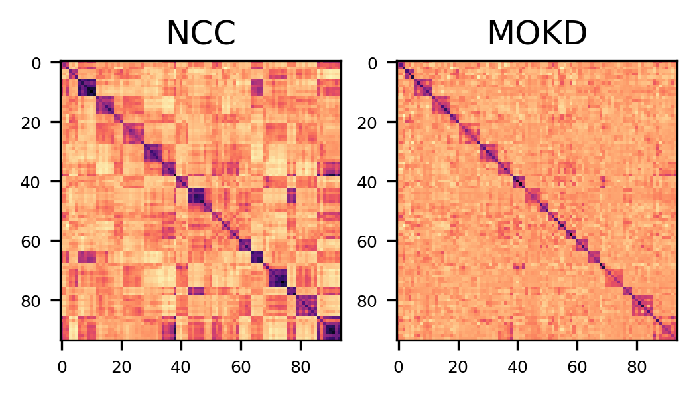

<center> 

# MOKD: Cross-domain Finetuning for Few-shot Classification via Maximizing Optimized Kernel Dependence 

</center>

<center>

[](https://arxiv.org/pdf/2405.18786) []() [](https://opensource.org/licenses/MIT) [](https://hongduantian.github.io/_pages/data/slides/ICML24_MOKD.pdf) [](https://hongduantian.github.io/_pages/data/poster/icml24_mokd.pdf) [](https://www.bilibili.com/video/BV1k4421X7zK/?spm_id_from=333.1007.top_right_bar_window_dynamic.content.click&vd_source=a1aae47e2835186f922fa2e1c94933c9) [](https://www.youtube.com/watch?v=uWMM63Sv0ZI&t=110s)

</center>

This repository contains the source codes for reproducing the results of ICML'24 paper:

 [**MOKD: Cross-domain Finetuning for Few-shot Classification via Maximizing Optimized Kernel Dependence**](https://arxiv.org/pdf/2405.18786). 

**Author List**: Hongduan Tian, Feng Liu, Tongliang Liu, Bo Du, Yiu-ming Cheung, Bo Han.


## Introduction

Current works regarding cross-domain few-shot classification mainly focus on adapting a simple transformation head on top of a frozen pretrained backbone (e.g. ResNet-18) by optimizing the _nearest centroid classifier_ loss (a.k.a. NCC-based loss). However, the undesirable phenomenon that there exists high similarity between samples from different classes is observed during the adaptation phase. The high similarity may induce uncertainty and further result in misclassification of data samples. 

<center>



</center>

To solve this problem, we propose a bi-level optimization framework *__maximizing optimized kernel dependence__* (__MOKD__) to learn a set of class-specific representations that matches the cluster structures indicated by the label information. Specifically, MOKD first optimizes the kernel used in Hilbert-Schmidt Independence Criterion to obtain the optimized kernel HSIC where the test power is maximized for precise detection of dependence. Then, the optimized kernel HSIC is further optimized to simultaneously maximize the dependence between representations and labels while minimize the dependence among all samples.

## Preparation
### Dependencies
In our experiments, the main dependences required are the following libraries:
```
Python 3.6 or greater (Ours: Python 3.8)
yTorch 1.0 or greater (Ours: torch=1.7.1, torchvision=0.8.2)
TensorFlow 1.14 or greater (Ours: TensorFlow=2.10)
tqdm (Ours: 4.64.1)
tabulate (0.8.10)
```

### Dataset
- Follow [Meta-Dataset repository](https://github.com/google-research/meta-dataset) to prepare `ILSVRC_2012`, `Omniglot`, `Aircraft`, `CU_Birds`, `Textures (DTD)`, `Quick Draw`, `Fungi`, `VGG_Flower`, `Traffic_Sign` and `MSCOCO` datasets.

- Follow [CNAPs repository](https://github.com/cambridge-mlg/cnaps) to prepare `MNIST`, `CIFAR-10` and `CIFAR-100` datasets.


### Backbone Pretraining
In this paper, we follow [URL](https://arxiv.org/pdf/2103.13841.pdf) and use ResNet-18 as the frozen backbone in all our experiments. For reproduction, two ways are provided:

__Train your own backbone.__ You can train the ResNet-18 backbone from scratch by yourself. The pretraining mainly contains two phases: domain-specific pretraining and universal backbone distillation.

To train the single domain-specific learning backbones (on 8 seen domains), run:
```
./scripts/train_resnet18_sdl.sh
```

Then, distill the model by running:
```
./scripts/train_resnet18_url.sh
```

__Use the released backbones.__ URL repository has released both universal backbone and single domain backbone. For simplicity, you can directly use the released model.
- [Single-domain networks (one for each dataset)](https://drive.google.com/file/d/1MvUcvQ8OQtoOk1MIiJmK6_G8p4h8cbY9/view?usp=sharing)

- [A single universal network (URL) learned from 8 training datasets](https://drive.google.com/file/d/1Dv8TX6iQ-BE2NMpfd0sQmH2q4mShmo1A/view?usp=sharing)

The backbones can be downloaded with the above links. To download the pretrained URL model, one can use `gdown` (installed by ```pip install gdown```) and execute the following command in the root directory of this project:
```
gdown https://drive.google.com/uc?id=1MvUcvQ8OQtoOk1MIiJmK6_G8p4h8cbY9 && md5sum sdl.zip && unzip sdl.zip -d ./saved_results/ && rm sdl.zip  # Universal backbone
gdown https://drive.google.com/uc?id=1Dv8TX6iQ-BE2NMpfd0sQmH2q4mShmo1A && md5sum url.zip && unzip url.zip -d ./saved_results/ && rm url.zip  # Domain specific backbones
```
In this way, the backbones are donwnloaded. Please create the ```./saved_results``` directory and place the backbone weights in it. 


### Evaluate MOKD
To evaluate the MODK, you can run:
```
./scripts/test_hsic_pa.sh
```
Specifically, the running command is:
```
python hsic_loss.py --model.name=url 
                    --model.dir ./url 
                    --data.imgsize=84\
                    --seed=41 \
                    --test_size=600 \
                    --kernel.type=rbf \
                    --epsilon=1e-5 \
                    --test.type=standard \
                    --experiment_name=mokd_seed41
```
The hyperparameters can be modified for different experiments:
- `model_name: ['sdl', 'url']`: `sdl` means using single domain backbone; `url` means using universal backbone.
- `model.dir`: Path to the backbone weights.
- `seed`: The random seed. All our results are the average of seed 41-45.
- `kernel.type ['linear', 'rbf', 'imq']`: Select different kernels to run MOKD.
- `test.type ['standard', '5shot', '1shot']`: Different task modes. `standard` means vary-way vary-shot tasks; `5shot` means vary-way 5-shot tasks; `1shot` means 5-way 1-shot tasks.

### Evaluate Pre-classifier Alignment (PA)
To evaluate Pre-classifier Alignment (PA), which is the typical case of URL, run:

```
./scripts/test_resnet18_pa.sh
```


## Acknowledgement
 
 The repository is built mainly upon these repositories:
 
- [VICO-UoE/URL [1]](https://github.com/VICO-UoE/URL);
- [google-research/meta-dataset [2]](https://github.com/google-research/meta-dataset)

[1] Li et al. [Universal representation learning from multiple domains for few-shot classification](https://arxiv.org/pdf/2103.13841), ICCV 2021.

[2] Triantafillou et al. [Meta-dataset: A dataset of datasets for learning to learn from few examples](https://arxiv.org/pdf/1903.03096), ICLR 2020.

## Citation
```
@inproceedings{tian2024mokd,
    title={MOKD:Cross-domain Finetuning for Few-shot Classification via Maximizing Optimized Kernel Dependence},
    author={Hongduan Tian and Feng Liu and Tongliang Liu and Bo Du and Yiu-ming Cheung and Bo Han},
    booktitle={International Conference on Machine Learning (ICML)},
    year={2024}
}
```

